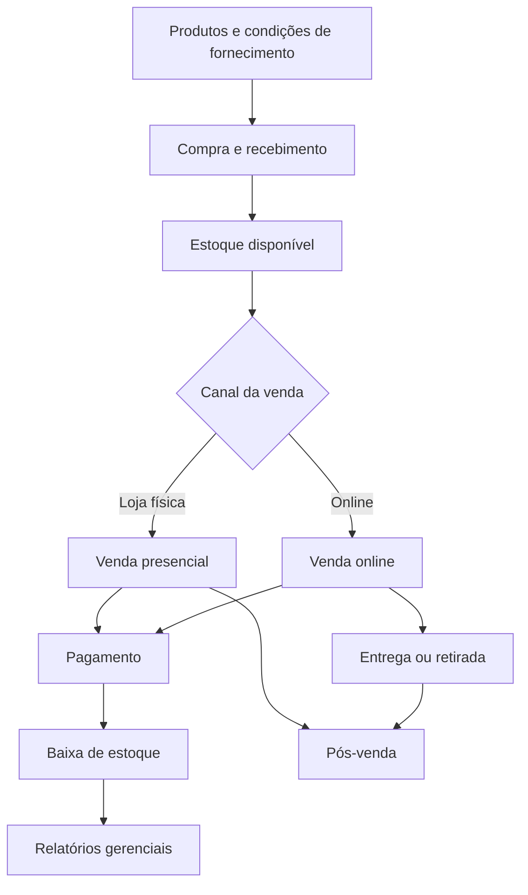
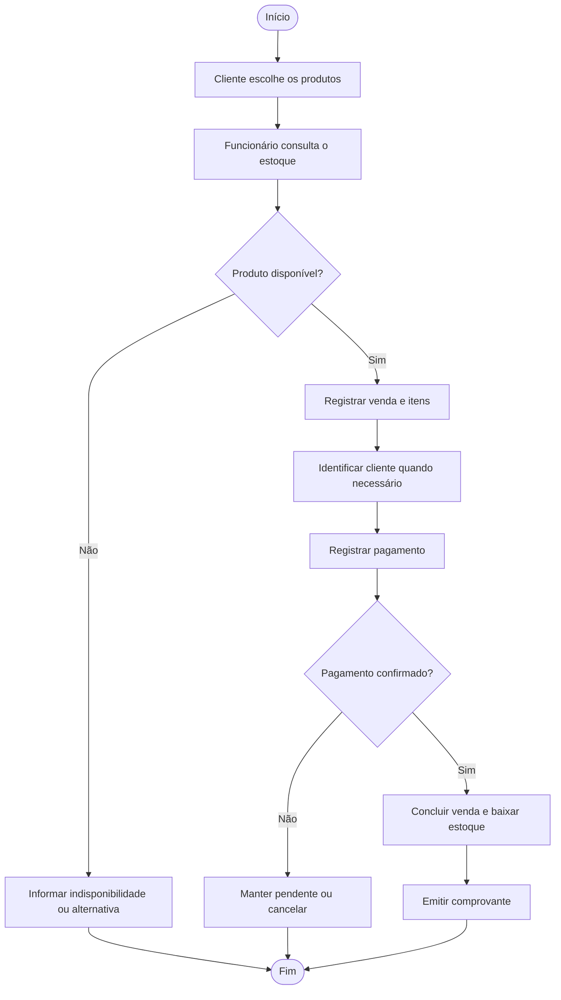
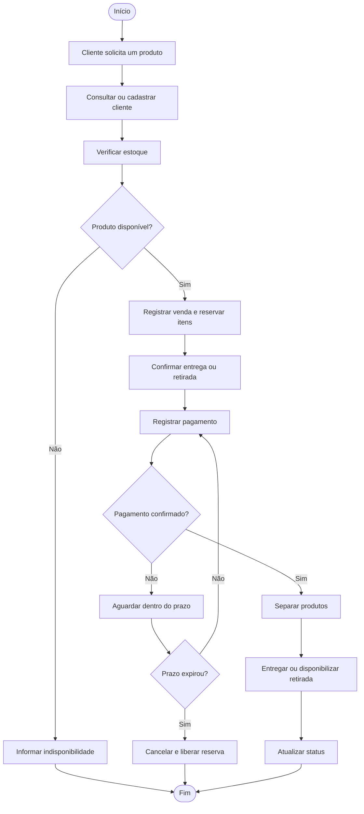
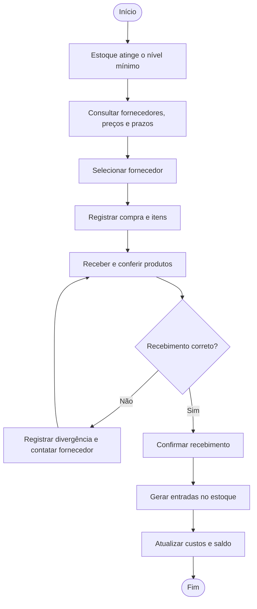
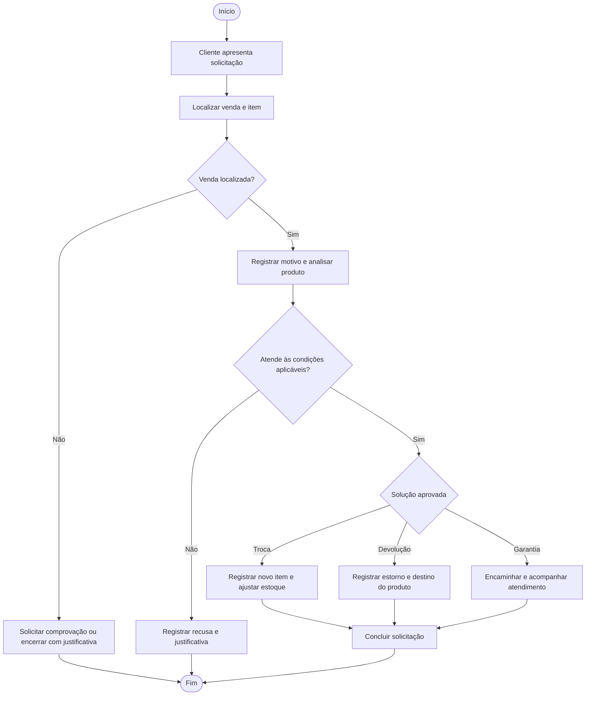
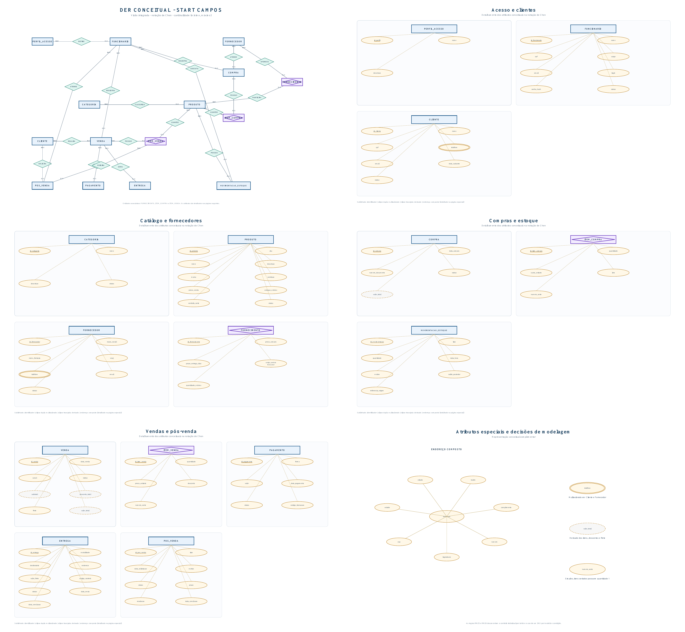

# Projeto ERP - Start Campos

> Primeira entrega do Projeto Integrador de Modelagem de Dados: do problema real ao Modelo Conceitual de Dados.

## Visão geral

Este projeto apresenta a análise e a modelagem conceitual de um sistema ERP para a **Start Campos**, loja de pequeno porte especializada na venda de videogames, consoles e acessórios. O sistema proposto integra as operações da loja física e dos canais de venda online, organizando informações de clientes, produtos, estoque, fornecedores, compras, vendas, pagamentos, entregas e pós-venda.

O trabalho segue a sequência proposta pela disciplina:

```text
Empresa -> Processos -> Problemas -> Requisitos -> Regras de negócio
-> Entidades -> Atributos -> Relacionamentos -> Cardinalidades -> DER
```
---

## 1. Identificação da equipe

| Integrante | RGM |
|---|---|
| Bruno Dutra | 47734248 |
| Eduarda Fernandes Barra Mansa | 47659661 |
| Gustavo Torres de Paula | 47349280 |
| Igor de Souza Sabino | 47407221 |
| Juliana Rodrigues | 49867075 |
| Lucas Pedrosa Colodro | 47399813 |
| Matheus Brizzi Gonçalves | 47454458 |
| Matheus Vitório Nascimento | 47603500 |
| Pedro Vasconcelos Sales | 47503092 |
| Rodrigo de Queiroz Souza Borges Filho | 47488085 |

| Informação acadêmica | Descrição |
|---|---|
| Curso | Engenharia de Software |
| Instituição | UNICID |
| Disciplina | Modelagem de Dados |
| Professor | Clovis Jose Ramos Ferraro |

---

## 2. Caracterização da empresa

### 2.1 Identificação

| --- | --- |

| Nome | Start Campos |
| Razão social localizada | Start Campos Ltda. |
| Segmento | Comércio varejista de videogames, consoles e acessórios eletrônicos |
| Localização | Rua Santa Ifigênia, 51, Santa Efigênia, São Paulo - SP |
| Canais de venda | Loja física e atendimento online |
| Público principal | Consumidores interessados em consoles, jogos e acessórios gamers |
 --- 

### 2.2 Produtos e serviços

A Start Campos comercializa consoles novos e seminovos, aparelhos de gerações atuais e anteriores, jogos e acessórios. O atendimento ocorre presencialmente e por canais digitais, pelos quais os clientes podem consultar produtos, negociar, realizar compras e solicitar entrega.

Um mesmo produto pode ser adquirido de fornecedores diferentes, com preço de compra e prazo de entrega próprios para cada combinação entre fornecedor e produto. Como a empresa também trabalha com seminovos, o controle deve considerar modelo, preço, condição, disponibilidade, número de série quando aplicável, garantia e histórico de movimentações.

### 2.3 Áreas consideradas

- Administração e controle de usuários;
- Atendimento presencial e online;
- Cadastro de clientes;
- Catálogo de produtos e categorias;
- Controle de estoque;
- Compras e fornecedores;
- Vendas presenciais e online;
- Pagamentos e controle financeiro;
- Separação e entrega;
- Trocas, devoluções e garantias;
- Consultas gerenciais e relatórios.

### 2.4 Funcionamento considerado

Na loja física, o cliente consulta os produtos, recebe atendimento, escolhe os itens e realiza o pagamento. A venda deve reduzir o estoque e registrar o funcionário responsável.

No atendimento online, o cliente solicita informações, escolhe os produtos, informa os dados necessários e seleciona uma forma de pagamento. Após a confirmação, os itens são separados e a venda segue para entrega ou retirada.

Para repor o estoque, a empresa consulta fornecedores, registra a compra e confere os produtos recebidos. A entrada atualiza o saldo e preserva o histórico da movimentação. Nas solicitações de troca, devolução ou garantia, a venda original e o item envolvido precisam ser localizados.

### 2.5 Informações essenciais

- Dados de clientes e funcionários:
- Produtos, categorias, marcas, condições e preços;
- Quantidades disponíveis e estoque mínimo;
- Fornecedores, produtos fornecidos, preços de compra e prazos;
- Vendas, itens, descontos e canais utilizados;
- Pagamentos e situações financeiras;
- Endereços, fretes e status das entregas;
- Números de série e comprovantes, quando aplicáveis;
- Trocas, garantias, motivos e soluções;
- Histórico de movimentações e responsáveis.

---

## 3. Justificativa da escolha

A Start Campos foi escolhida porque um dos integrantes mencionou que trabalhava na loja, então usamos para a realização da tarefa. e possui processos variados e integrados que podem ser representados por um sistema ERP. A operação simultânea de vendas físicas e online exige que informações de produtos, estoque, clientes, pagamentos e entregas permaneçam consistentes em todos os canais.

O trabalho com produtos novos e seminovos aumenta a necessidade de diferenciar a condição dos itens, registrar números de série quando necessário, acompanhar garantias e impedir a venda de produtos indisponíveis.

O negócio é adequado à disciplina porque permite transformar situações concretas em processos, requisitos, regras de negócio, entidades, relacionamentos e cardinalidades. A centralização dos dados pode reduzir divergências de estoque, duplicidade de cadastros, perda de registros e dificuldade para gerar relatórios.

---

## 4. Problemas e necessidades identificados

| ID | Problema | Consequência | Necessidade |
|---|---|---|---|
| P01 | Estoque físico e vendas online sem atualização centralizada | Venda de produto indisponível e divergência de saldo | Estoque único para todos os canais |
| P02 | Informações de produtos em controles separados | Preços, descrições e condições inconsistentes | Catálogo centralizado |
| P03 | Vendas online registradas manualmente | Perda de informações e dificuldade de acompanhamento | Registro estruturado das vendas online |
| P04 | Dados de clientes repetidos ou incompletos | Duplicidade e dificuldade no pós-venda | Cadastro único de clientes |
| P05 | Falta de rastreabilidade de seminovos e números de série | Dificuldade em trocas, garantias e origem do item | Controle de condição e série |
| P06 | Produtos e condições de fornecimento registrados separadamente | Dificuldade para comparar preços e prazos | Relacionar cada fornecedor aos produtos que oferece |
| P07 | Pagamentos e entregas acompanhados separadamente | Liberação incorreta e atrasos não identificados | Integração entre venda, pagamento e entrega |
| P08 | Trocas e garantias sem histórico centralizado | Retrabalho e falta de acompanhamento | Módulo de pós-venda |
| P09 | Relatórios produzidos manualmente | Demora e menor confiabilidade nas decisões | Relatórios automáticos |
| P10 | Alterações de estoque sem identificação do responsável | Dificuldade de auditoria | Histórico de movimentações |

---

## 5. Processos de negócio

| ID | Processo | Participantes | Evento inicial | Atividades principais | Informações geradas | Resultado |
|---|---|---|---|---|---|---|
| PR01 | Venda presencial | Cliente e funcionário | Cliente escolhe um produto | Consultar estoque, registrar itens e pagamento e atualizar saldo | Venda, itens, pagamento e movimentação | Venda concluída e estoque atualizado |
| PR02 | Venda online | Cliente, funcionário e entrega | Cliente solicita um produto | Identificar cliente, reservar itens, confirmar pagamento e separar | Cliente, venda, pagamento, endereço e entrega | Venda entregue ou retirada |
| PR03 | Reposição de estoque | Funcionário e fornecedor | Estoque baixo ou necessidade comercial | Comparar condições, registrar compra e conferir recebimento | Fornecimento, compra, itens e entrada | Produtos recebidos e saldo atualizado |
| PR04 | Gestão de produtos | Usuário autorizado | Inclusão ou alteração de produto | Conferir cadastro, categoria, condição, preço e estoque mínimo | Produto e categoria | Catálogo atualizado |
| PR05 | Atendimento ao cliente | Cliente e funcionário | Primeiro atendimento ou identificação | Consultar cadastro ou registrar cliente | Cadastro e histórico | Cliente identificado |
| PR06 | Troca, devolução ou garantia | Cliente e funcionário | Cliente apresenta solicitação | Localizar venda e item, analisar condições e registrar solução | Item vendido, motivo, prazo e solução | Atendimento concluído ou recusado |
| PR07 | Controle financeiro | Usuário autorizado | Compra, venda ou pagamento | Consolidar valores das operações | Entradas, saídas e totais | Visão financeira e relatórios |
| PR08 | Gestão de usuários | Administrador | Admissão, mudança de função ou desligamento | Cadastrar, associar perfil, alterar ou inativar usuário | Funcionário, perfil e status | Permissões atualizadas |

### 5.1 Integração dos processos



---

## 6. Requisitos funcionais

| ID | Requisito funcional |
|---|---|
| RF01 | O sistema deverá autenticar os usuários por login e senha. |
| RF02 | O sistema deverá cadastrar, consultar, alterar e desativar funcionários. |
| RF03 | O sistema deverá associar cada funcionário a um perfil de acesso. |
| RF04 | O sistema deverá cadastrar, consultar, alterar e inativar clientes. |
| RF05 | O sistema deverá identificar possíveis duplicidades de CPF, telefone ou e-mail. |
| RF06 | O sistema deverá cadastrar e organizar categorias. |
| RF07 | O sistema deverá cadastrar produtos com SKU, nome, marca, descrição, condição, preço e estoque mínimo. |
| RF08 | O sistema deverá registrar número de série nos itens controlados individualmente. |
| RF09 | O sistema deverá cadastrar fornecedores e relacionar os produtos oferecidos, com preço e prazo. |
| RF10 | O sistema deverá registrar compras e seus respectivos itens. |
| RF11 | O sistema deverá atualizar o estoque após o recebimento de uma compra. |
| RF12 | O sistema deverá registrar entradas, saídas, reservas e ajustes de estoque. |
| RF13 | O sistema deverá alertar quando o saldo atingir o estoque mínimo. |
| RF14 | O sistema deverá registrar vendas realizadas na loja física. |
| RF15 | O sistema deverá registrar vendas originadas nos canais online. |
| RF16 | O sistema deverá verificar a disponibilidade antes de confirmar um item. |
| RF17 | O sistema deverá registrar itens, quantidades, preços e descontos de cada venda. |
| RF18 | O sistema deverá reservar ou baixar o estoque conforme o status da venda. |
| RF19 | O sistema deverá aceitar uma ou mais formas de pagamento na mesma venda. |
| RF20 | O sistema deverá controlar o status dos pagamentos. |
| RF21 | O sistema deverá registrar entregas, retiradas, endereços, fretes, rastreios e status. |
| RF22 | O sistema deverá cancelar vendas e estornar o estoque quando aplicável. |
| RF23 | O sistema deverá registrar trocas, devoluções e garantias vinculadas ao item vendido. |
| RF24 | O sistema deverá consultar o histórico de compras e atendimentos do cliente. |
| RF25 | O sistema deverá emitir relatórios de vendas, compras, estoque, pagamentos, entregas e pós-venda. |
| RF26 | O sistema deverá filtrar informações por período, cliente, produto, canal, status e funcionário. |
| RF27 | O sistema deverá registrar o usuário responsável pelas operações relevantes. |
| RF28 | O sistema deverá apresentar um painel com indicadores da operação. |

---

## 7. Requisitos não funcionais

| ID | Categoria | Requisito não funcional |
|---|---|---|
| RNF01 | Segurança | As senhas deverão ser protegidas e nunca armazenadas em texto puro. |
| RNF02 | Acesso | Funções e dados deverão ser liberados conforme o perfil do usuário. |
| RNF03 | Auditoria | Vendas, cancelamentos, descontos e ajustes deverão registrar data, hora e responsável. |
| RNF04 | Privacidade | Dados pessoais deverão ser acessados apenas para finalidades operacionais autorizadas. |
| RNF05 | Desempenho | Consultas operacionais comuns deverão responder em até 3 segundos em condições normais. |
| RNF06 | Disponibilidade | O sistema deverá permanecer disponível durante o funcionamento da loja e dos canais online. |
| RNF07 | Confiabilidade | Uma operação confirmada não poderá atualizar apenas parte dos registros envolvidos. |
| RNF08 | Usabilidade | As telas deverão apresentar linguagem clara, campos identificados e retorno das ações. |
| RNF09 | Responsividade | A interface deverá funcionar em computadores, tablets e celulares. |
| RNF10 | Recuperação | O banco deverá possuir backups periódicos e procedimento de restauração testado. |
| RNF11 | Evolução | A estrutura deverá aceitar novas categorias, fornecedores, canais e entregas sem perder histórico. |

Os valores de desempenho, disponibilidade e periodicidade de backup são parâmetros propostos e devem ser validados com a empresa.

---

## 8. Regras de negócio

| ID | Regra |
|---|---|
| RN01 | Cada produto deve pertencer a exatamente uma categoria. |
| RN02 | Uma categoria pode existir sem produtos e classificar vários produtos. |
| RN03 | Uma venda deve possuir pelo menos um item para ser concluída. |
| RN04 | Cada item de venda deve se referir a exatamente um produto. |
| RN05 | A quantidade vendida não pode ultrapassar a disponível, considerando reservas ativas. |
| RN06 | O estoque somente deve ser reduzido quando a venda atingir o status de confirmação. |
| RN07 | O cancelamento deve liberar a reserva ou devolver ao estoque os itens comercializáveis. |
| RN08 | Uma venda presencial pode ocorrer sem cliente identificado, salvo quando necessário para entrega, documento fiscal, garantia ou pós-venda. |
| RN09 | Toda venda online deve estar associada a um cliente identificado. |
| RN10 | Toda venda deve ser registrada por exatamente um funcionário. |
| RN11 | Uma venda pode possuir mais de um pagamento. |
| RN12 | A venda só será considerada paga quando os pagamentos confirmados atingirem o valor devido. |
| RN13 | Uma venda gera no máximo uma entrega; vendas de balcão ou retiradas podem não possuir entrega. |
| RN14 | Toda compra deve estar associada a exatamente um fornecedor e um funcionário responsável. |
| RN15 | Uma compra deve possuir pelo menos um item antes de ser confirmada. |
| RN16 | O recebimento deve gerar movimentações de entrada para os produtos conferidos. |
| RN17 | Todo ajuste manual de estoque deve possuir motivo e funcionário responsável. |
| RN18 | Produtos seminovos devem ter condição, observações e número de série registrados quando aplicável. |
| RN19 | O pós-venda deve estar vinculado ao item vendido e a um cliente identificado. |
| RN20 | Troca, devolução ou garantia depende da venda, do produto, do prazo e da política aplicável. |
| RN21 | Cada funcionário deve possuir exatamente um perfil de acesso ativo por vez. |
| RN22 | Registros usados em operações concluídas não devem ser excluídos; devem ser inativados. |
| RN23 | Um fornecedor pode fornecer vários produtos, e um produto pode ser fornecido por vários fornecedores. |
| RN24 | Preço de compra, prazo de entrega, código do fornecedor e quantidade mínima pertencem à relação entre fornecedor e produto. |
| RN25 | Produtos controlados por série devem ser registrados individualmente, com quantidade igual a 1 em cada ItemCompra ou ItemVenda. |
| RN26 | Cada SKU representa uma combinação específica de modelo e condição, como novo ou seminovo. |
| RN27 | Cada item de compra deve se referir a exatamente um produto. |
| RN28 | Cada movimentação de estoque deve se referir a exatamente um produto. |
| RN29 | Toda movimentação de estoque deve estar associada a exatamente um funcionário responsável, herdado da operação de origem ou informado no ajuste. |
| RN30 | Toda solicitação de pós-venda deve possuir exatamente um funcionário responsável. |

---

## 9. Restrições e políticas organizacionais

| ID | Restrição ou política |
|---|---|
| RP01 | Apenas administradores podem gerenciar usuários e perfis. |
| RP02 | Descontos acima do limite interno exigem autorização de um administrador. |
| RP03 | Cancelamentos de vendas pagas devem registrar responsável e justificativa. |
| RP04 | Ajustes manuais de estoque exigem perfil autorizado e motivo obrigatório. |
| RP05 | Informações financeiras detalhadas ficam restritas aos perfis autorizados. |
| RP06 | A venda online só pode ser liberada após a confirmação do pagamento ou autorização registrada. |
| RP07 | A entrega deve usar o endereço confirmado e manter histórico de status. |
| RP08 | Trocas, devoluções e garantias devem obedecer à política vigente e à legislação aplicável. |
| RP09 | Produtos seminovos devem ser avaliados antes da venda. |
| RP10 | Dados pessoais não devem ser usados fora das finalidades informadas ao cliente. |
| RP11 | Backups devem ser executados regularmente e armazenados em local protegido. |
| RP12 | Prazos, descontos e garantias devem ser parametrizáveis, pois dependem de decisões internas. |

### 9.1 Matriz de rastreabilidade

| Problema ou necessidade | Requisitos | Regras e políticas | Elementos do modelo | Processo |
|---|---|---|---|---|
| P01 - Divergência de estoque | RF11, RF12, RF16 e RF18 | RN05, RN06, RN07 e RN16 | Produto, ItemVenda e MovimentacaoEstoque | PR01, PR02 e PR03 |
| P03 - Registro manual online | RF15, RF18, RF20 e RF21 | RN09, RN12, RN13 e RP06 | Cliente, Venda, Pagamento e Entrega | PR02 |
| P04 - Duplicidade de clientes | RF04, RF05 e RF24 | RN08, RN09, RN19 e RN22 | Cliente, Venda e PosVenda | PR02, PR05 e PR06 |
| P05 - Rastreabilidade de seminovos | RF07, RF08 e RF23 | RN18, RN19, RN20, RN25 e RP09 | Produto, ItemCompra, ItemVenda e PosVenda | PR04 e PR06 |
| P06 - Condições de fornecimento | RF09 e RF10 | RN14, RN23 e RN24 | Fornecedor, Produto, Fornecimento e Compra | PR03 |
| P07 - Pagamento e entrega separados | RF19, RF20 e RF21 | RN11, RN12, RN13, RP06 e RP07 | Venda, Pagamento e Entrega | PR01 e PR02 |
| P08 - Pós-venda sem histórico | RF23 e RF24 | RN19, RN20, RN30 e RP08 | Cliente, ItemVenda e PosVenda | PR06 |
| P10 - Movimentação sem responsável | RF12 e RF27 | RN16, RN17, RN28, RN29, RP03 e RP04 | Produto, Funcionario e MovimentacaoEstoque | PR01 e PR03 |

---

## 10. Fluxogramas

### 10.1 Venda presencial



### 10.2 Venda online



### 10.3 Compra e reposição



### 10.4 Troca, devolução ou garantia



---

## 11. Entidades

| Entidade | Tipo | Finalidade | Origem na análise |
|---|---|---|---|
| Cliente | Forte | Representar a pessoa atendida e seu histórico | Cadastro, venda online, entrega e pós-venda |
| PerfilAcesso | Forte | Definir conjuntos de permissões | Controle de acesso |
| Funcionario | Forte | Identificar quem executa operações | Vendas, compras, estoque e pós-venda |
| Categoria | Forte | Organizar o catálogo | Classificação de produtos |
| Produto | Forte | Representar cada item comercializado | Catálogo, estoque, compras e vendas |
| Fornecedor | Forte | Representar quem fornece os produtos | Processo de reposição |
| Fornecimento | Associativa | Relacionar fornecedor e produto e registrar condições | Comparação de preço e prazo |
| Compra | Forte | Registrar uma aquisição | Compras e entradas de estoque |
| ItemCompra | Associativa | Relacionar produtos a cada compra | Quantidade e custo por compra |
| Venda | Forte | Registrar uma operação física ou online | Processo comercial |
| ItemVenda | Associativa | Relacionar produtos a cada venda | Preço e desconto por venda |
| Pagamento | Forte | Registrar valores recebidos | Confirmação financeira e pagamento dividido |
| Entrega | Forte | Acompanhar o envio de uma venda | Vendas entregues ou retiradas |
| MovimentacaoEstoque | Forte | Manter o histórico do saldo | Entradas, saídas, reservas e ajustes |
| PosVenda | Forte | Registrar troca, devolução ou garantia | Atendimento posterior à venda |

> Não foi identificada entidade fraca. Todas as entidades possuem identificador próprio. Uma dependência operacional, como Entrega depender de Venda, não torna a entidade fraca se ela puder ser identificada pelo próprio identificador.

---

## 12. Atributos

| Entidade | Principais atributos |
|---|---|
| Cliente | `id_cliente`, `nome`, `cpf`, `telefone`, `email`, `data_cadastro`, `status` |
| PerfilAcesso | `id_perfil`, `nome`, `descricao` |
| Funcionario | `id_funcionario`, `nome`, `cpf`, `cargo`, `email`, `login`, `senha_hash`, `status` |
| Categoria | `id_categoria`, `nome`, `descricao`, `status` |
| Produto | `id_produto`, `sku`, `nome`, `descricao`, `marca`, `condicao`, `preco_venda`, `estoque_minimo`, `controla_serie`, `status` |
| Fornecedor | `id_fornecedor`, `razao_social`, `nome_fantasia`, `cnpj`, `telefone`, `email`, `status` |
| Fornecimento | `id_fornecimento`, `preco_compra`, `prazo_entrega_dias`, `codigo_produto_fornecedor`, `quantidade_minima` |
| Compra | `id_compra`, `data_compra`, `numero_documento`, `status`, `valor_total` |
| ItemCompra | `id_item_compra`, `quantidade`, `custo_unitario`, `lote`, `numero_serie` |
| Venda | `id_venda`, `data_venda`, `canal`, `status`, `subtotal`, `desconto_total`, `frete`, `valor_total` |
| ItemVenda | `id_item_venda`, `quantidade`, `preco_unitario`, `desconto`, `numero_serie` |
| Pagamento | `id_pagamento`, `forma`, `valor`, `data_pagamento`, `status`, `codigo_transacao` |
| Entrega | `id_entrega`, `modalidade`, `destinatario`, `endereco`, `valor_frete`, `codigo_rastreio`, `status`, `data_envio`, `data_conclusao` |
| MovimentacaoEstoque | `id_movimentacao`, `tipo`, `quantidade`, `data_hora`, `motivo`, `saldo_posterior`, `referencia_origem` |
| PosVenda | `id_pos_venda`, `tipo`, `data_solicitacao`, `motivo`, `status`, `prazo`, `resolucao`, `data_conclusao` |

### 12.1 Classificação dos atributos

| Classificação | Exemplos | Justificativa |
|---|---|---|
| Identificador | `id_cliente`, `id_produto`, `id_venda` | Distingue cada ocorrência da entidade. |
| Simples | `cpf`, `sku`, `status`, `numero_serie`, `saldo_posterior` | Possui um único valor no contexto da ocorrência. |
| Composto | `endereco` de Entrega | Pode ser dividido em logradouro, número, complemento, bairro, cidade, estado e CEP. |
| Multivalorado | `telefone` de Cliente ou Fornecedor | A mesma ocorrência pode possuir mais de um telefone. |
| Derivado | `subtotal`, `desconto_total` e `valor_total` de Venda; `valor_total` de Compra | Pode ser calculado a partir dos itens, descontos e frete. |

`numero_serie` é simples: nos produtos controlados individualmente, cada ItemCompra ou ItemVenda representa uma unidade e possui quantidade igual a 1, conforme RN25. `saldo_posterior` também é simples porque preserva o saldo observado após a movimentação. O atributo `condicao` permanece em Produto porque cada combinação entre modelo e condição utiliza um SKU próprio, conforme RN26.

---

## 13. Relacionamentos

| Relacionamento | Significado |
|---|---|
| PerfilAcesso define Funcionario | Determina o perfil do funcionário. |
| Cliente realiza Venda | Liga o cliente identificado às suas vendas. |
| Funcionario registra Venda | Identifica o responsável pela venda. |
| Venda possui ItemVenda | Representa os itens da venda. |
| Produto compõe ItemVenda | Indica qual produto foi vendido. |
| Venda recebe Pagamento | Registra um ou mais pagamentos. |
| Venda gera Entrega | Acompanha a entrega quando existente. |
| Fornecedor atende Compra | Identifica o fornecedor da compra. |
| Fornecedor oferece Fornecimento | Registra as condições mantidas pelo fornecedor. |
| Produto participa de Fornecimento | Identifica o produto da condição de fornecimento. |
| Funcionario registra Compra | Identifica quem cadastrou a compra. |
| Compra possui ItemCompra | Representa os itens adquiridos. |
| Produto compõe ItemCompra | Indica qual produto foi comprado. |
| Categoria classifica Produto | Organiza o catálogo. |
| Produto possui MovimentacaoEstoque | Registra o histórico do saldo. |
| Funcionario executa MovimentacaoEstoque | Identifica o responsável pela movimentação. |
| ItemVenda origina PosVenda | Liga o atendimento ao item vendido. |
| Cliente solicita PosVenda | Identifica o solicitante. |
| Funcionario atende PosVenda | Identifica o responsável pelo atendimento. |

### 13.1 Relacionamentos N:N e entidades associativas

Foram identificadas três situações N:N:

1. **Venda e Produto:** uma venda contém vários produtos e um produto aparece em várias vendas. **ItemVenda** registra quantidade, preço praticado, desconto e número de série.
2. **Compra e Produto:** uma compra contém vários produtos e um produto aparece em várias compras. **ItemCompra** registra quantidade, custo, lote e número de série.
3. **Fornecedor e Produto:** um fornecedor oferece vários produtos e um produto pode ser oferecido por vários fornecedores. **Fornecimento** registra preço de compra, prazo, código do fornecedor e quantidade mínima.

Esses atributos pertencem às associações porque dependem do par relacionado. O preço e o prazo, por exemplo, podem variar para cada combinação entre fornecedor e produto.

---

## 14. Cardinalidades

As cardinalidades foram verificadas nos dois sentidos. A coluna **Base** indica a regra que sustenta cada decisão.

| Entidade A | Cardinalidade A | Relacionamento | Cardinalidade B | Entidade B | Base |
|---|:---:|---|:---:|---|---|
| PerfilAcesso | (0,N) | define | (1,1) | Funcionario | RN21 |
| Cliente | (0,N) | realiza | (0,1) | Venda | RN08 e RN09 |
| Funcionario | (0,N) | registra | (1,1) | Venda | RN10 |
| Venda | (1,N) | possui | (1,1) | ItemVenda | RN03 |
| Produto | (0,N) | compõe | (1,1) | ItemVenda | RN04 |
| Venda | (0,N) | recebe | (1,1) | Pagamento | RN11 e RN12 |
| Venda | (0,1) | gera | (1,1) | Entrega | RN13 |
| Fornecedor | (0,N) | atende | (1,1) | Compra | RN14 |
| Fornecedor | (0,N) | oferece | (1,1) | Fornecimento | RN23 e RN24 |
| Produto | (0,N) | participa | (1,1) | Fornecimento | RN23 e RN24 |
| Funcionario | (0,N) | registra | (1,1) | Compra | RN14 |
| Compra | (1,N) | possui | (1,1) | ItemCompra | RN15 |
| Produto | (0,N) | compõe | (1,1) | ItemCompra | RN27 |
| Categoria | (0,N) | classifica | (1,1) | Produto | RN01 e RN02 |
| Produto | (0,N) | possui | (1,1) | MovimentacaoEstoque | RN16 e RN28 |
| Funcionario | (0,N) | executa | (1,1) | MovimentacaoEstoque | RN17 e RN29 |
| ItemVenda | (0,N) | origina | (1,1) | PosVenda | RN19 e RN20 |
| Cliente | (0,N) | solicita | (1,1) | PosVenda | RN19 |
| Funcionario | (0,N) | atende | (1,1) | PosVenda | RN30 |

---

## 15. Dicionário de dados conceitual preliminar

O dicionário permanece no nível conceitual, concentrando-se em identificar, descrever, classificar e associar regras aos atributos. Tipos de banco de dados, tamanhos, nulidade, chaves primárias e chaves estrangeiras serão definidos somente nas etapas de modelo lógico e físico.

O conteúdo completo está em [docs/dicionario-dados-conceitual.md](docs/dicionario-dados-conceitual.md).

Exemplo:

| Entidade | Atributo | Classificação | Descrição | Regra/observação |
|---|---|---|---|---|
| Cliente | `id_cliente` | Identificador | Identifica unicamente o cliente. | Não pode se repetir. |
| Cliente | `nome` | Simples | Nome completo do cliente. | Obrigatório. |
| Cliente | `cpf` | Simples | Documento do cliente. | Não pode se repetir quando informado. |
| Cliente | `telefone` | Multivalorado | Telefone de contato. | Pode haver mais de um. |

---

## 16. Diagrama Entidade-Relacionamento - DER

O DER oficial utiliza a **notação de Chen**. Ele contém uma visão integrada dos relacionamentos e páginas complementares que apresentam, para todas as entidades, os atributos relevantes e os respectivos identificadores sublinhados. As entidades associativas aparecem com a representação própria e todas as ligações apresentam cardinalidade mínima e máxima.

Por se tratar do modelo conceitual, as chaves são representadas pelos atributos identificadores `id_*` sublinhados. Chaves estrangeiras serão acrescentadas somente no modelo lógico, pois nesta etapa as ligações são demonstradas pelos relacionamentos do DER.



- [Abrir versão em PDF](docs/der/der-conceitual.pdf)
- [Editar no draw.io](docs/der/der-conceitual.drawio)
- [Abrir somente a visão geral](docs/der/der-visao-geral.png)

### 16.1 Legenda

- Retângulo: entidade forte;
- Retângulo envolvendo losango: entidade associativa;
- Losango: relacionamento;
- Elipse: atributo simples;
- Elipse dupla: atributo multivalorado;
- Elipse tracejada: atributo derivado;
- Atributo sublinhado: identificador;
- Pares como `(0,N)` e `(1,1)`: cardinalidade mínima e máxima.

---

## 17. Justificativas técnicas

### 17.1 Produto e ItemVenda

Produto mantém os dados permanentes do catálogo. ItemVenda registra o que ocorreu em uma venda específica, porque quantidade, preço, desconto e número de série dependem da operação. A decisão resolve o N:N entre Venda e Produto e é sustentada por P01, RF17, RN03, RN04 e RN25.

### 17.2 Compra e ItemCompra

Uma compra pode possuir vários produtos e o mesmo produto pode aparecer em várias compras. ItemCompra resolve esse N:N e preserva quantidade, custo, lote e série de cada ocorrência, conforme RF10, RN15, RN16 e RN25.

### 17.3 Fornecedor, Produto e Fornecimento

Fornecedor e Produto possuem cardinalidade N:N conforme RN23. Fornecimento existe porque preço, prazo, código do fornecedor e quantidade mínima dependem simultaneamente do fornecedor e do produto, conforme P06, RF09 e RN24. O preço em Fornecimento representa a condição oferecida; o custo em ItemCompra preserva o valor efetivamente praticado.

### 17.4 Cliente opcional na venda

Cliente possui cardinalidade `(0,N)` e Venda possui `(0,1)` nesse relacionamento porque uma venda rápida de balcão pode ocorrer sem cadastro, conforme RN08. Nas vendas online e no pós-venda, a identificação é obrigatória por RN09 e RN19.

### 17.5 Pagamentos

Venda pode possuir zero pagamentos enquanto está pendente e vários quando há divisão entre formas diferentes. Cada Pagamento pertence a exatamente uma Venda. A decisão é sustentada por RF19, RF20, RN11 e RN12.

### 17.6 Entrega opcional

Uma Venda gera no máximo uma Entrega porque vendas de balcão ou retiradas podem não exigir envio. Quando existe, a Entrega pertence exclusivamente àquela Venda e preserva o endereço usado, conforme RF21, RN13 e RP07.

### 17.7 Histórico de estoque

O saldo isolado não explica como o estoque chegou a determinado valor. MovimentacaoEstoque registra tipo, quantidade, momento, responsável, motivo e saldo posterior, atendendo P01, P10, RF12, RF27, RN16, RN17, RN28 e RN29.

### 17.8 Pós-venda ligado ao item

Trocas, devoluções e garantias envolvem um item específico, e não necessariamente toda a venda. A ligação com ItemVenda permite recuperar produto, preço, quantidade e série relacionados, conforme P08, RF23, RN19, RN20 e RN30.

### 17.9 Perfil de acesso separado

PerfilAcesso foi separado de Funcionario para evitar repetição das regras de acesso e permitir que vários funcionários compartilhem o mesmo perfil, conforme RF03, RNF02, RN21 e RP01.

### 17.10 Preservação do histórico

Produtos, categorias, fornecedores, clientes e funcionários envolvidos em operações concluídas devem ser inativados em vez de excluídos. A decisão evita a perda de referências necessárias para relatórios, auditoria e pós-venda, conforme RN22.

### 17.11 Número de série e condição

`numero_serie` é atributo simples de ItemCompra e ItemVenda. Quando o produto exige controle individual, a quantidade do item é 1, conforme RN25. A condição permanece em Produto porque o modelo adota um SKU distinto para cada combinação de modelo e condição, conforme RN26.

---

## 18. Conclusão

A análise da Start Campos demonstrou que uma loja com atendimento físico e online depende da integração de várias informações. O modelo proposto conecta clientes, funcionários, produtos, fornecedores, compras, estoque, vendas, pagamentos, entregas e pós-venda.

Os problemas sustentam os requisitos; os requisitos e regras sustentam as entidades, atributos, relacionamentos e cardinalidades. Assim, o DER não é um desenho isolado, mas a consequência da análise do funcionamento considerado para a empresa.

Esta entrega fornece a base para as próximas etapas: modelo lógico, normalização, definição dos tipos de dados, modelo físico e implementação do banco de dados.

---

## Arquivos da entrega

- [DER conceitual completo em PNG](docs/der/der-conceitual.png)
- [Visão geral dos relacionamentos em PNG](docs/der/der-visao-geral.png)
- [DER conceitual em PDF](docs/der/der-conceitual.pdf)
- [DER conceitual editável no draw.io](docs/der/der-conceitual.drawio)
- [Dicionário de dados conceitual](docs/dicionario-dados-conceitual.md)

- [Checklist da primeira entrega](docs/checklist-entrega.md)

## Fontes consultadas

- [Instagram da Start Campos](https://www.instagram.com/startcampos_/)

- **Manual da Primeira Entrega - Projeto Integrador de Modelagem de Dados: do problema real ao Modelo Conceitual de Dados**, disponibilizado pela disciplina.
- **Aula 4 - Do mundo real ao DER: como representar as regras de um negócio**, disponibilizada pela disciplina.
